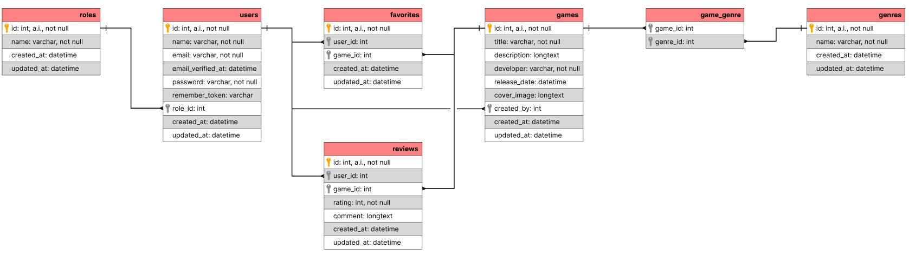

## Monday 29-12-2025
- Added a 'My Games'-page where users have an overview of all games they added to the website.
- Added an activate-toggle functionality for games. Users can make their games inactive or active via the Active/Inactive button on the 'My Games'-page. When a game is not active, only the owner of the game and administrators can view the game.
    - Used documentation:
        - [Eloquent Mutators](https://laravel.com/docs/12.x/eloquent-mutators#attribute-casting)
- Updated the admin games page with new rows: details and status.
- Typo fix on the Inactive button.

## Sunday 28-12-2025
- Added the profile settings page to the navigation bar.
- Change the password requirements for updating your password to match the requirements for creating a password (while registering)
- Added a game policy for editing and deleting games. Only owners of the game can edit it and delete it.
    - Used documentation:
        - [Authorization: Writing Policies](https://laravel.com/docs/12.x/authorization#writing-policies)
- Created new middleware for admins. Specific pages are only for admins.
    - Used documentation:
        - [Middleware](https://laravel.com/docs/12.x/middleware)
- Created a new route group for admin pages using my own admin middleware.
    - Used documentation:
        - [Routing: Route Groups](https://laravel.com/docs/12.x/routing#route-groups)
- Added an admin users page, where admins can change user roles and delete users
- Added an admin games page, where admins can delete games (even if the game doesn't belong to them)
- Added an admin genres page, where admins can create new genres and delete genres
- Added an admin roles page, where admins can create new roles and delete roles

## Saturday 27-12-2025
- Added the navigation to creating a new game in the navigation bar
- Added buttons for editing your games and deleting your games on the detailpage
- Added a view for favorite games and added the route to the navigation bar
    - Used documentation:
        - [Eloquent Relationships](https://laravel.com/docs/12.x/eloquent-relationships#querying-relationship-existence)
- Added genre filters on the browse games page
    - Used documentation:
        - [Requests](https://laravel.com/docs/12.x/requests#retrieving-input)
        - [Database Pagination](https://laravel.com/docs/12.x/pagination)
        - [Blade](https://laravel.com/docs/12.x/blade#additional-attributes)
- Added text searching on the browse games page. This also works together with the genre filters.
    - Used documentation:
        - [Stack Overflow](https://stackoverflow.com/questions/70736335/laravel-search-and-filter)

## Wednesday 24-12-2025
- Added a list of genres via my new GenreSeeder (using a foreach loop)
- Changed the 'name' row to unique inside the 'genres' table using a new migration
- Changed the app layout and updated to home page (welcome and dashboard) to match my page subject
- Created the games CRUD: GameController with views (and new game form component)
    - Used documentation:
        - [Controllers](https://laravel.com/docs/12.x/controllers)
        - [DigitalOcean CRUD](https://www.digitalocean.com/community/tutorials/simple-laravel-crud-with-resource-controllers)
        - [Views](https://laravel.com/docs/12.x/views)
        - [Database: Pagination](https://laravel.com/docs/12.x/pagination)
        - [Blade: Components](https://laravel.com/docs/8.x/blade#components)
- Updated route middleware for the game pages
    - Used documentation:
        - [Routing](https://laravel.com/docs/12.x/routing#route-group-middleware)
        - [Middleware](https://laravel.com/docs/12.x/middleware#assigning-middleware-to-routes)
- Added an 'add game to favorites'-functionality (with a button that only appears while logged in)

## Tuesday 23-12-2025
- Created models (and changed the User model) for all database tables: Role, Genre, Game, Review and Favorite.
    - Used documentation:
        - [Eloquent](https://laravel.com/docs/12.x/eloquent)
        - [Eloquent Relationships](https://laravel.com/docs/12.x/eloquent-relationships)
- Added the Admin and User roles and created two first users (one admin and one user) through database seeding
    - Used documentation:
        - [Database: Seeding](https://laravel.com/docs/12.x/seeding)
- Added a standard user role to the registering users. Now when you register your account, you get assigned a user role.
- Added some extra password validation rules when registering. Now you have to create a password with a minimum of six characters and you must use at least one uppercase character, one number and one special character.
    - Used documentation:
        - [Validation: validating passwords](https://laravel.com/docs/12.x/validation#validating-passwords)

## Monday 22-12-2025
- Installed Laravel Herd and Laravel Breeze and created a new Laravel project.
- Changed the .env file to adjust the app name and app URL.
- Made an ERD:

- Created user stories:
    1. As a visitor, I want to register and log in, so that I can access user-only functionality.
    2. As a user, I want to access protected pages, so that non-authenticated users cannot use restricted features.
    3. As a user, I want to upload my own games, so that other users can see them on the site.
    4. As a user, I want to edit my games, so that I can add new information and such.
    5. As a user, I want to delete my games, so my game is no longer on the website.
    6. As a user, I want to edit only the games that I have uploaded, so that other users cannot modify my content.
    7. As a system, I want to block unauthorized users from editing or deleting items they do not own, even when accessing URLs directly.
    8. As an user, I want to activate or deactivate a game using a button, so that I can control its visibility.
    9. As a user, I want input fields to be validated on the server, so that invalid or incomplete data cannot be submitted.
    10. As a user, I want to see clear validation error messages, so that I know how to correct my input.
    11. As a user, I want to search for indie games using free text, so that I can find games by title or description.
    12. As a user, I want to filter games by genre using filter buttons, so that I can easily narrow down the results.
    13. As a user, I want to combine search and filters, so that I can find specific games more efficiently.
    14. As an administrator, I want to access an admin-only section, so that I can manage games and users.
    15. As an administrator, I want to delete games uploaded by users, so that inappropriate content can be removed.
    16. As an administrator, I want users to be able to submit a review only after logging in on at least five different days, so that spam and low-effort reviews are reduced.
    17. As an administrator, I want to see an overview dashboard, so that I can quickly monitor platform activity.
    18. As an administrator, I do not want visitors to be able to access any user or admin functionality without authentication.
    19. As a user, I want to edit my profile information, so that I can keep my personal data up to date.
    20. As a user, I want to save games as favorites, so that I can easily find them later.
    21. As a user, I want to write reviews for games, so that I can share my opinion with others.
    22. As a user, I want to adjust my reviews, so that I can remove spelling errors.
    23. As a user, I want to delete my reviews, so that I can remove my previous thoughts on the game.
    24. As an administrator, I want to delete reviews by users, so that inappropiate content can be removed.
    25. As a visitor, I want to browse through games, so I can find new games to play.
- Made a global planning:
    - 22-12-2025
        - Laravel project + Git repository.
        - ERD.
        - User stories.
        - Planning.
        - Changelog.
        - Migrations
    - 23-12-2025
        - Login/register
        - Validation
        - Roles
    - 24-12-2025
        - Games CRUD
        - Favorites
    - 27-12-2025
        - Filtering and searching
    - 28-12-2025
        - User settings
        - Admin pages
    - 29-12-2025
        - Turning games on and off
    - 30-12-2025
        - Games reviews CRUD
    - 31-12-2025
        - Deeper validation (5 days login) -> Eloquent
    - 02-01-2026
        - Security (OWASP top 10)
    - 03-01-2026
        - Polish and test
- Made a changelog.
- Made migrations based on my ERD (used [Laravel Docs](https://laravel.com/docs/12.x/migrations) and [Laracasts](https://laracasts.com/discuss/channels/laravel/update-table-from-migrate) (specifically for how to name a migration which updates an existing table)).
